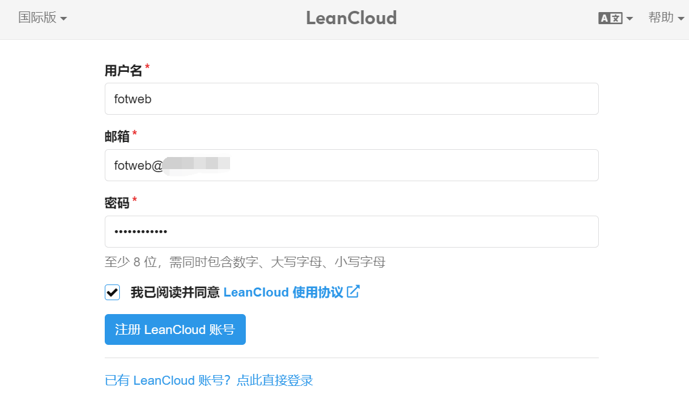
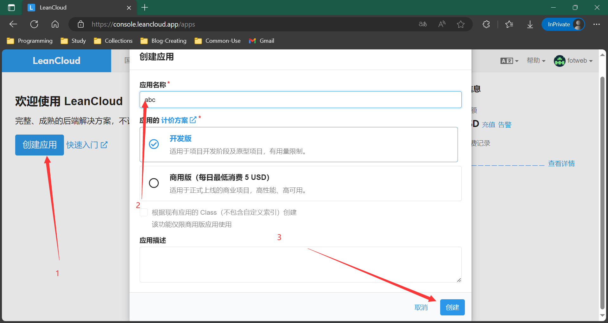
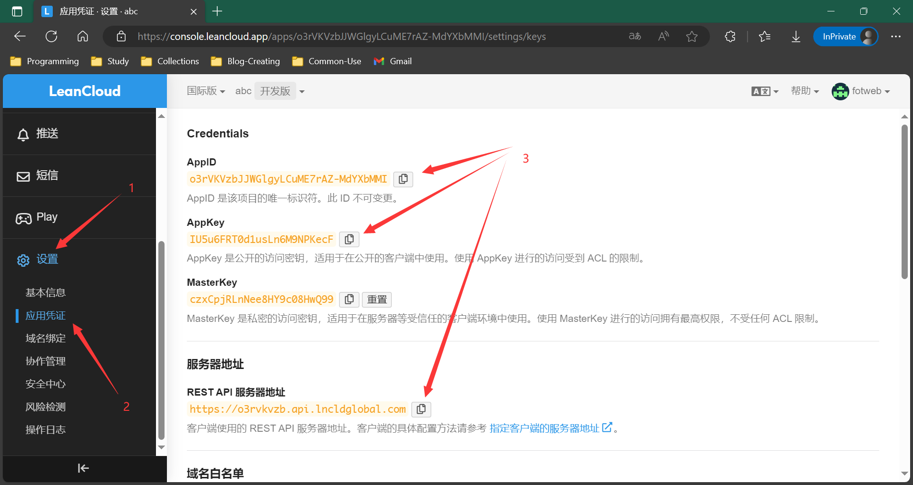
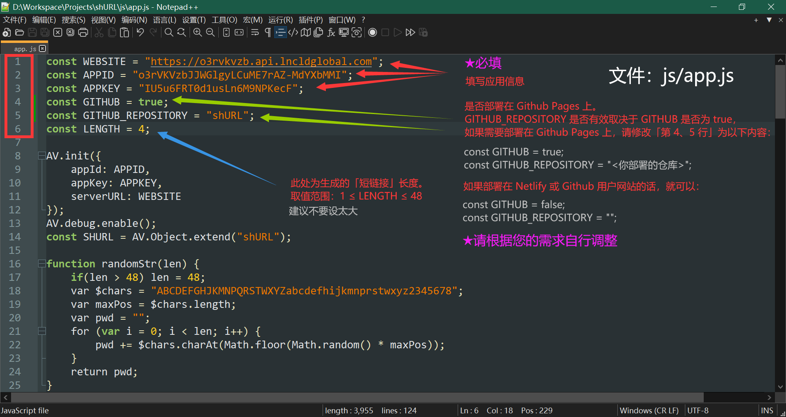
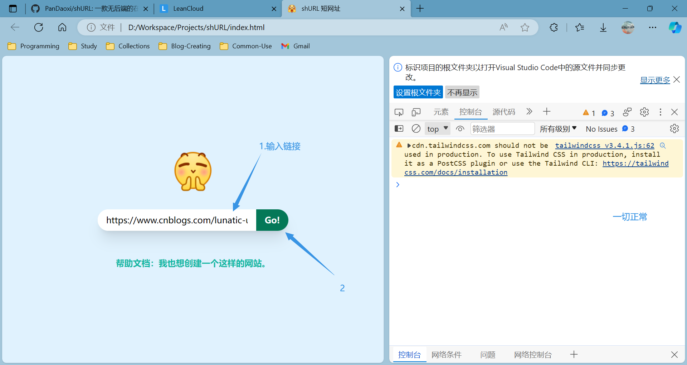
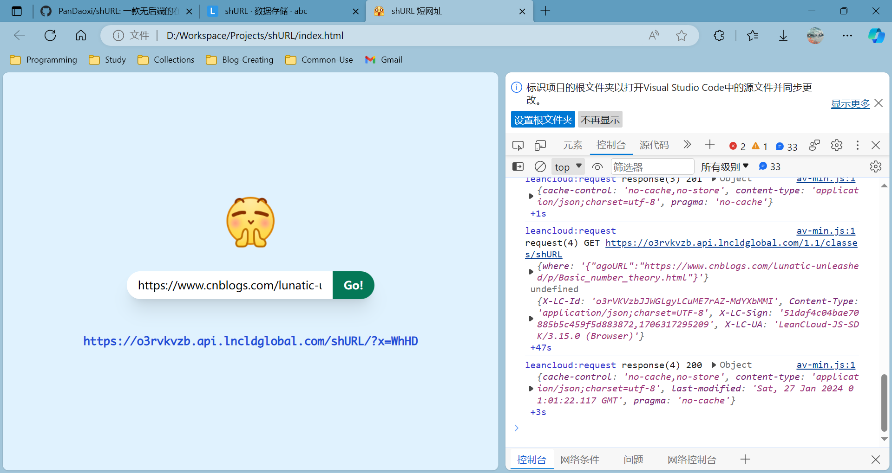
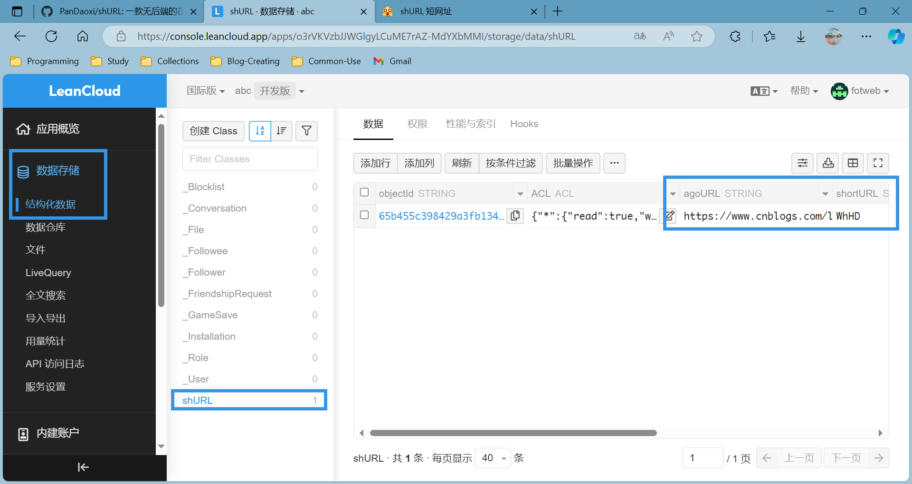
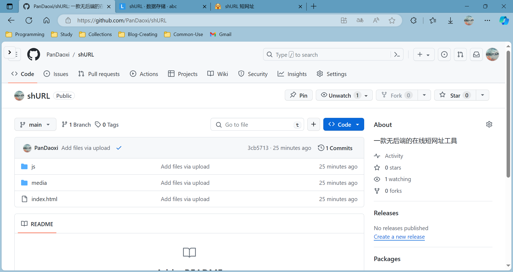
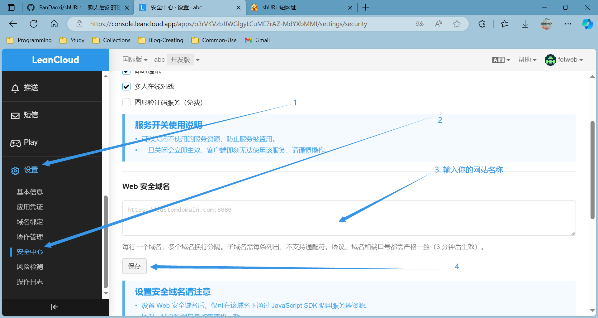

# 「$\texttt{shURL}$ 短网址」

>   欢迎使用 $\texttt{shURL}$！
>   这是 $\texttt{shURL}$ 工具（以下简称此工具）的使用文档。
>
>   [TOC]

---

## 总览

此工具为一「短网址」工具。

何为短网址？简单来讲，就是以工具将原网址缩短长度，使访问更加便捷。
举个简单的例子：

```
原网址：
https://www.bilibili.com/video/BV1DK4y1z7wq/?vd_source=c2c603cbba8a549035c5aaed2e9faa97
短网址：
https://pandaoxi.github.io/shURL/?x=Gs64
```

显然，它的实现是需要后端服务器的。但是，此工具选择了基于 $\texttt{LeanCloud}$ 的线上储存，因此可以运行于静态网站，如 $\texttt{Github/Gitee Pages}$、$\texttt{Netlify}$ 等。

## 操作步骤

1.   注册一个 $\texttt{LeanCloud}$​ （如果你使用国外网络环境，推荐使用**国际版**）账号。

     

2.   验证邮箱后，创建一个应用。

     

3.   复制凭证信息。

     

4.   在此工具中修改相关内容。

     

5.   本地测试。

     

     

     

6.   关于个性化：

     您可以修改 `media` 文件夹下的网站图标（`favicon.ico`）和标志（`logo.png`）。

7.   修改 `WEBSITE` 为您自己的网站。

8.   上传。

     

9.   修改安全网址。

     

10.   测试，完成。

## 补充

您可以在**结构化数据控制台**上增、删短网址。